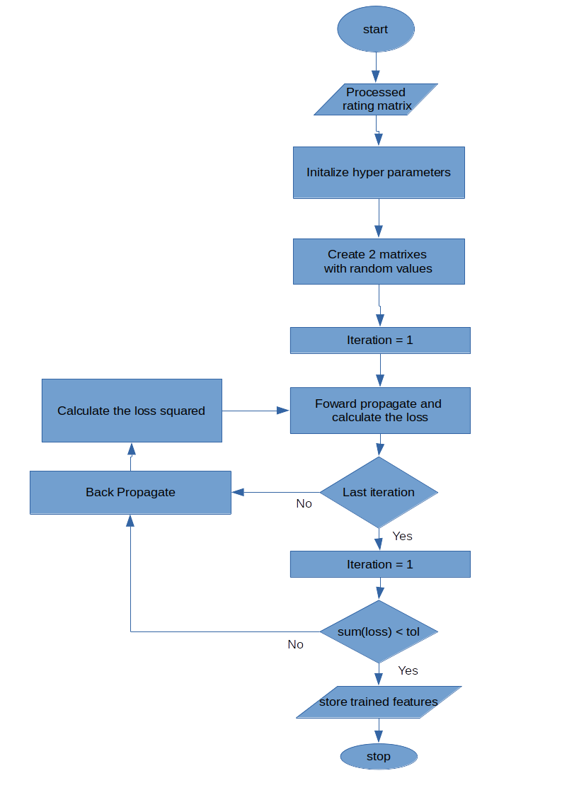

# SAKO RECOMMENDATION ENGINE PROJECT

Project statement: Build a recommendation engine tfor the Sako user application that recommends products from a database of products (groceries) in their categrories. 

### Milestones

    • Recommend to few users on new platform with little data (cold-start problem)
    • Recommend to users on growing platform
    • Recommend to users on established platform (with enough data to be fully functional)
    • Recommend products to new users after model is trained
    • Recommend new products to users after model is trained
    • online incremental training of model (warm training)
    • Retraining model occasionally to revive model performance (performance reduce with time)
    • Model serving

### Project targets

    • Model should be able to give useful recommendation custom to users.
    • Model should be able to retrain its self at post-determined specifications.
    • Model should be efficient and versatile.
    • Model should solve the cold-start problem.
    • Automated incremental learning

### Project features (data needed)

    • users serialized unique ID.
    • products serialized unique ID.
    • users ratings related to product.
    • users time spent on products.
    • users number of products/category/vendor visits.
    • (product description to train model on similar products)

## Recommendation System:

## Model
Model algorithm is designed based on the matrix factorization principle (dimensionality reduction). It is a linear model with no inputs or activation function. The complete model is design as an incremental learning algorithm i.e it is able to retrain itself without forgetting its previous knowledge (warm start).

__Other research algorithms:__

    • weighted Matrix factorization: can account for the problem of user bias.
    • RNN: can find partern in a user buying habits.
    • clustering: can solve the problem of recommending to new users.

__Build language:__

    • Python
    • SQL
    • (C)

__Project Frameworks:__

    • Flask
    • (MongoDB)

__Project source code:__

    • [https://github.com/jake-ephraim/Recommendation-Engine/tree/master](https://github.com/jake-ephraim/Recommendation-Engine/tree/master)

### Model  training flowchart

## Deployment
Model will be deployed as a service i.e it will be hosted on a server where it can be ascessed through a post or get request. The model will be continously monitored and maintained by the machine learning team. This is because models intelligence tend to degrade overtime as human behavoir also changes with time, therefore, the model has to be retrained occationally and redeployed to service.
